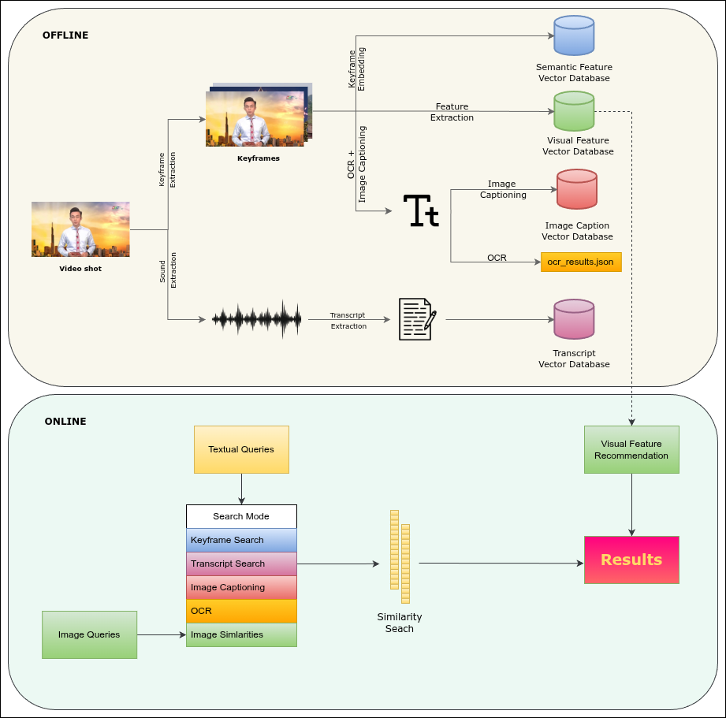

# 🎬 float19 Video Search - Keyframe Edition

This repository contains the implementation of the float97's video retrieval system, developed for the HCMC AI Challenge 2025. The system is designed to perform complex event retrieval on large, untrimmed video collections, covering domains such as news, sports, tourism, and cooking.

The solution addresses three primary competition tasks: Textual Known Item Search (KIS), Visual Question Answering (Q&A), and Temporal Retrieval and Alignment of Key Events (TRAKE).

## ✨ Key Features

- **Multimodal Search**: Retrieval is performed not just on visual features, but also on ASR transcripts, OCR text, and image captions.
- **Temporal Alignment (TRAKE)**: Capable of handling complex temporal queries by decomposing events into sequential sub-queries to identify precise frame alignment.
- **Visual Recommendation**: Includes a keyframe-based recommendation system leveraging DINOv3 to find visually similar moments.
- **High-Performance Indexing**: Utilizes FAISS for efficient, large-scale vector similarity search.
- **Interactive Interface**: A streamlined web application built with Streamlit that intelligently routes queries to the appropriate modality index.

## Intended Pipeline



> **⚠️ Work In Progress**: The components related to the **Vintern-1B-v3_5** model for OCR extraction and image captioning are currently under development. The related code has been moved to the `wip/` folder. The current system focuses on keyframe extraction, embedding generation, and multimodal search using SigLIP, DINOv3, and WhisperX.

## 🏗️ System Architecture

The architecture is divided into an Offline Processing Pipeline for indexing and an Online Retrieval Phase for user interaction.

### 1. Offline Indexing

- **Keyframe Extraction**: Uses TransNetV2 (PyTorch implementation) to segment videos based on scene changes, reducing redundancy.
- **Semantic Embeddings**: ViT-gopt-16-SigLIP2-384 encodes keyframes into rich semantic vectors.
- **Audio Transcription**: WhisperX ("turbo" model) generates time-stamped Vietnamese transcripts.
- **OCR & Captioning**: Vintern-1B-v3_5 extracts on-screen text and generates descriptive captions.
- **Visual Similarity**: DINOv3 features are extracted to power the recommendation engine.

### 2. Online Retrieval

- **Query Processing**: Text queries are embedded using SigLIP (for visual search) or all-MiniLM-L6-v2 (for transcript/OCR search).
- **Search Engine**: FAISS indices are queried to retrieve the most relevant keyframes or video segments.

## 📦 Installation

**Requirements**: Python 3.10+ (tested on Python 3.10)

### Option 1: Using Conda (Recommended)

```bash
conda create -n aic python=3.10
conda activate aic
pip install -r requirements.txt
```

### Option 2: Using Virtual Environment

```bash
python -m venv venv
source venv/bin/activate  # On Windows: venv\Scripts\activate
pip install -r requirements.txt
```


## 📁 Project Structure

Your project structure should look like this:

```
float97_Video_Search/
│
├── 📂 data-source/                      # Source videos (read-only)
│   └── videos/                          # Place your .mp4 files here
│
├── 📂 data-staging/                     # Intermediate processing artifacts
│   ├── keyframes/                       # Extracted keyframe images (JPG)
│   ├── preprocessing/                   # TransNetV2 scene detection results
│   ├── map-keyframes/                   # CSV files mapping keyframes to frame indices
│   ├── audios/                          # Extracted audio files (WAV)
│   ├── audio-chunk-timestamps/          # Audio chunk timing metadata
│   ├── transcripts/                     # WhisperX transcription results (JSON)
│   └── vintern_results.json             # Vintern OCR & caption results (WIP)
│
├── 📂 data-index/                       # Search indices for fast retrieval
│   ├── siglip_keyframe_embedding.index  # FAISS index for visual search
│   ├── siglip_keyframe_metadata.npy     # Metadata for visual search results
│   ├── transcript_embeddings.npy        # Embeddings for transcript search
│   ├── transcript_metadata.json         # Metadata for transcript search
│   └── keyframe_metadata.npy            # General keyframe metadata
│
├── 📂 wip/                              # Work in Progress - Experimental features
│   ├── ocr_object.py                    # Vintern OCR extraction
│   ├── ocr_processing.py                # Vintern processing pipeline
│   ├── ocr_cleaning.py                  # Vintern results cleaning
│   ├── vintern_cleaning.py              # Additional Vintern utilities
│   ├── caption_search.py                # Caption-based search (experimental)
│   ├── caption_embedding.py             # Caption embeddings (experimental)
│   └── check_vintern_processing.py      # Vintern processing verification
│
├── 📂 transnetv2-weights/               # Pre-trained TransNetV2 model weights
│
├── 🎯 Core Processing Scripts
│   ├── transnetv2.py                    # Scene boundary detection
│   ├── keyframe_extractor.py            # Extract keyframes from videos
│   ├── dinov3_embedding.py              # Generate DINOv3 embeddings for similarity
│   ├── transcript_extractor.py          # Extract audio and generate transcripts
│   ├── transcript_embedding.py          # Generate transcript embeddings
│   └── keyframe_embedding.py            # Generate SigLIP visual embeddings
│
├── 🔍 Search Modules
│   ├── keyframe_search.py               # Visual keyframe search
│   ├── siglip_search.py                 # SigLIP-based visual search
│   ├── dinov3_search.py                 # DINOv3-based similarity search
│   ├── transcript_search.py             # Audio transcript search
│   ├── ocr_search.py                    # OCR text search (Vintern-based)
│   ├── temporal_search.py               # Temporal event search
│   └── attention_search.py              # Attention-based search
│
├── 🌐 Web Application
│   ├── web_app.py                       # Main Streamlit web interface
│   └── frame_playback.py                # Video frame playback utilities
│
├── 🛠️ Utilities
│   ├── helpers.py                       # Common helper functions
│   ├── http_requests.py                 # HTTP request utilities for submission
│   ├── json_to_csv.py                   # JSON to CSV converter
│   ├── load_all_video_keyframes_info.py # Load all keyframe information
│   └── old_temp_search.py               # Legacy search implementation
│
├── 📜 Scripts
│   ├── run-pipeline.sh                  # Main processing pipeline executor
│   ├── preprocessing.sh                 # Preprocessing script
│   ├── create_dir.sh                    # Create required directories
│   └── format-code.sh                   # Code formatting utility
│
├── 📋 Configuration
│   ├── requirements.txt                 # Python dependencies
│   ├── README.md                        # This file
│   └── AIC_pipeline.png                 # Architecture diagram
│
└── 📊 Query & Submission
    ├── _query/                          # Test queries for development
    ├── pack1-groupA/                    # Competition query pack 1
    ├── pack3-groupA/                    # Competition query pack 3
    └── submission/                      # Generated submission files
```

### Processing Workflow

The system processes videos in the following stages:

1. **Scene Detection** (`transnetv2.py`)
   - Analyzes videos to detect scene boundaries
   - Outputs: `data-staging/preprocessing/*.npy`

2. **Keyframe Extraction** (`keyframe_extractor.py`)
   - Extracts representative frames from each scene
   - Outputs: `data-staging/keyframes/*.jpg` and `data-staging/map-keyframes/*.csv`

3. **Visual Embedding** (`keyframe_embedding.py`, `dinov3_embedding.py`)
   - Generates semantic embeddings for visual search
   - Outputs: `data-staging/siglip-features/*.npy`

4. **Audio Processing** (`transcript_extractor.py`, `transcript_embedding.py`)
   - Extracts audio and generates Vietnamese transcripts using WhisperX
   - Creates embeddings for text-based search
   - Outputs: `data-staging/transcripts/*.json`, `data-index/transcript_embeddings.npy`

5. **Index Building**
   - Creates FAISS indices for efficient similarity search
   - Outputs: `data-index/*.index` files

6. **Search & Retrieval** (`web_app.py`)
   - Interactive web interface for querying the indexed data
   - Supports visual search, transcript search, and temporal queries

### Setup Data Directories

```bash
# Create required directories
mkdir -p data-source/videos
mkdir -p data-staging/{keyframes,preprocessing,map-keyframes,clip-features,audios,audio-chunk-timestamps,transcripts}
mkdir -p data-index
mkdir -p submission
```

Or run:

```bash
bash create-dir.sh
```

### Add Your Videos

Place your MP4 video files in `data-source/videos/`:

```bash
# Example
cp /path/to/your/videos/*.mp4 data-source/videos/
```

## �🚀 Quick Start

### 1. Process Videos (Indexing)

Run the complete pipeline to extract keyframes and generate embeddings:

```bash
bash run-pipeline.sh
```

This will:

- Extract keyframes from all videos in `data-source/videos/`
- Generate CLIP embeddings for each keyframe
- Build a FAISS search index

### 2. Start the Web Interface

**With GPU**: Set the library path first:

```bash
LD_LIBRARY_PATH=$CONDA_PREFIX/lib:/usr/lib/x86_64-linux-gnu:$LD_LIBRARY_PATH
```

Launch the Streamlit web application:

```bash
streamlit run web_app.py --server.headless true
```

Or, set up the remote server, then run this command on the server:

```bash
streamlit run web_app.py --server.address 0.0.0.0 --server.port 8501 --server.headless true
```

Then on your client device, go to:

```
http://<tailscale-ip>:8501
```

### 3. Search Your Videos

- **Text Search**: Describe what you're looking for (e.g., "person walking")
- **Export Results**: Select keyframes and download as CSV

## 🔍 How It Works

1. **Video Processing**: TransNetV2 analyzes videos to detect scene boundaries
2. **Keyframe Selection**: Representative frames are extracted from each scene
3. **Feature Extraction**: CLIP model generates 512-dimensional embeddings for each keyframe
4. **Index Building**: FAISS creates an efficient search index from all embeddings
5. **Query Processing**: Text queries are encoded and matched against the index
6. **Result Ranking**: Results are ranked by cosine similarity and returned

## � Managing Dependencies

We recommend using [uv](https://github.com/astral-sh/uv) for dependency management:

```bash
# Compile requirements
uv pip compile requirements.in --output-file requirements.txt

# Sync dependencies
uv pip sync requirements.txt
```